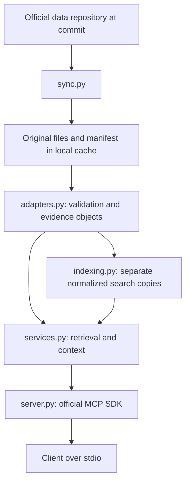

# Architecture and provenance

The implemented pipeline is:

`domain.py` defines strict Pydantic input and output models. `server.py` uses the
official SDK's low-level callback API so it can publish exact schemas and return
structured errors without hiding the domain envelope. It does not implement
JSON-RPC, version negotiation, or framing. The SDK supports modern and legacy
connections. `cli.py` keeps sync separate from the offline tool process.

Core snapshots contain five allowlisted source files; full snapshots add sixteen
dhātu-form files and the śabda catalog. Each includes `manifest.json`, with a
single upstream commit, download timestamp, byte size, and SHA-256 for each file.
Sync validates a staging directory, renames it into an immutable snapshot, then
atomically replaces the `current` pointer. Concurrent syncs may both succeed; the
last pointer switch wins, and neither alters existing snapshots. Old snapshots
are retained for reproducibility. Validation failures do not switch the pointer.

The server loads a snapshot once. Local hashes detect corruption; they do not
provide a cryptographic signature from the upstream authors. HTTPS and immutable
commit URLs identify the acquisition source. A cached snapshot can be inspected
with `status`. No network access occurs during tool calls.

Every scholarly object has its own provenance. For example, the catalog record
for 6.1.77 points to `/data/2516` in the pinned `sutraani/data.txt`; its source
explanation points to `/61077/sa` in `sutraani/sutrartha.txt`. Search matches extend
the record pointer to the field actually matched. For `pc`, the match text is a
lexical segment of the full source field, not an invented source field.

`retrieved_at` is a file download timestamp, not the current time or upstream
publication date. Source-file hashes refer to full original files. Neither
canonical numbering, search ranks, nor adjacency is claimed to be upstream prose.
Raw source metadata is retained so consumers can audit those deterministic
projections. Commentary slices give code-point offsets, total length and the next
offset; clients can reconstruct exact strings. Empty and absent values are
distinguished from unloaded sources and failed imports.

Source markup is returned as inert text. An agent must treat it as evidence, never
as instructions. The extractive demo quotes sources and does not execute markup.
No inferred relationships, translations, generated commentary, or silent repair
rules enter the source layer.

The current index scans precomputed lexical entries. This is appropriate for the
inspected corpus size. `SearchIndex` is a protocol so a different deterministic
index can replace it without changing retrieval or MCP contracts.

`form_sources.py` declares the additional allowlist and source dimensions.
`form_adapter.py` validates every stored form field on import and decodes table
coordinates without modifying raw strings. `form_models.py` defines form contracts;
`forms.py` retrieves paradigms and scans candidate fields for exact reverse matches.
Reverse lookup caches at most sixteen query pages, avoiding a large index containing
every inflected surface. Each page retains distinct source and grammatical occurrences.
See [form contracts](forms.md) for encodings, coverage and corpus-wide validation.

## Known limits

- Three commentary collections; no commentary full-text search.
- Morphology retrieval covers stored paradigms; no runtime generation, sandhi
  validation, compound analysis, or contextual disambiguation is implemented.
- Encoded `an`, `ad`, grammatical codes and source markup remain uninterpreted.
- The demonstration client is extractive; natural-language explanation by an LLM
  requires a separately supplied answerer and its own evaluations.
- The stdio tests cover the bundled SDK's modern and legacy modes, not every
  third-party host UI.
- Data permission and work-specific attribution are documented in
  [third-party notices](../THIRD_PARTY_NOTICES.md); no blanket data license is claimed.
