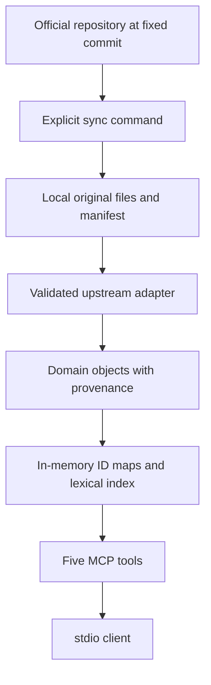

# Stage 1 — research and proposed architecture

Status: historical Stage-1 research, subsequently approved for implementation. Research date: 2026-09-28.
The body below records the original findings and proposal. The implementation and current usage are described in [README](../README.md) and [architecture](architecture.md).

## Recommendation

Build a Python package using the official MCP Python SDK, Pydantic models, stdio, and an immutable local data snapshot. Five read-only tools sit above a small upstream adapter and deterministic in-memory retrieval. Download only selected files from `ashtadhyayi-com/data`, pinned to one commit. Keep original bytes and strings; index separate search representations. Do not merge `data-edit` into the published corpus.

See [ADR-001](adr/001-python-local-snapshots.md) for the technology decision and [tool contracts](phase-1-tool-contracts.md) for the proposed interface.

## Inspection method and reproducibility

Inspected both complete GitHub recursive file inventories (neither reported truncation), downloaded and parsed all 20 `sutraani` files, the dhātu catalog, and representative secondary datasets. All inspected text datasets decoded as UTF-8. Research downloads live in temporary storage, outside this project.

Resolved commit IDs separately through the commits API:

| Repository | Commit | Commit timestamp |
| --- | --- | --- |
| [data](https://github.com/ashtadhyayi-com/data/tree/5744762f010d677cfb43f347a42d02796cf615d6) | `5744762f010d677cfb43f347a42d02796cf615d6` | 2026-09-13T15:28:36Z |
| [data-edit](https://github.com/ashtadhyayi-com/data-edit/tree/c9f00534e27ba61ed42f4d6ef573cde2a9798eb8) | `c9f00534e27ba61ed42f4d6ef573cde2a9798eb8` | 2026-09-27T18:49:59Z |

Counts below describe these snapshots, not eternal properties of the texts. Browsed SDK documentation separately; no SDK was installed or exercised during Stage 1.

## Actual upstream structure

### Sūtra catalog

[`sutraani/data.txt`](https://github.com/ashtadhyayi-com/data/blob/5744762f010d677cfb43f347a42d02796cf615d6/sutraani/data.txt) is JSON despite its `.txt` suffix: `{ "name": ..., "data": [records...] }`. It contains **3,983 records**, with unique `i` identifiers, ordered numerically by `a`, `p`, `n`.

| Field | Observed representation / adapter treatment |
| --- | --- |
| `i` | String identifier, e.g. `61077`; preserve as upstream ID |
| `a`, `p`, `n` | String chapter, pāda and sūtra coordinates; validate and derive `6.1.77` |
| `s` | Original Devanāgarī sūtra text |
| `e` | Upstream Latin search text, e.g. `ikoyanachi`; do not label it IAST |
| `pc` | Delimited word metadata; preserve raw and index the text before the first `$` in each `##` segment |
| `ss` | Expanded source string; preserve, including trailing whitespace |
| `an`, `ad` | Encoded context metadata, with different delimiter structures; retain raw in Phase 1 |
| Other fields | `skn`, `lskn`, `mskn`, `sskn`, `plskn`, `lpn`, `sk_chapter`, `lsk_chapter`, `type`, `rpn`, `psn`, `ps_chapter`; retain names and values without guessing undocumented codes |

Verified directly in downloaded records:

| Canonical number | Upstream ID | Exact `s` |
| --- | --- | --- |
| 6.1.77 | 61077 | इको यणचि |
| 6.1.87 | 61087 | आद्गुणः |

For 6.1.77, `pc` is `इकः$S$6$1$##यण्$S$1$1$##अचि$S$7$1$`; `ss` is `इकः यण् अचि संहितायाम् `; `ad` is `संहितायाम्$6$1$72`. Therefore a literal `यण्` search can match actual source word metadata. It need not strip virāma or infer a grammatical relationship. For 6.1.87, `an` contains `अचि$61077`. We can expose that source value without claiming to have implemented a general anuvṛtti resolver.

### Commentaries and explanations

These are separate JSON documents, predominantly maps from upstream sūtra ID to a string. They are not fields embedded in each sūtra record. Inspected all of the following files under [`sutraani/`](https://github.com/ashtadhyayi-com/data/tree/5744762f010d677cfb43f347a42d02796cf615d6/sutraani):

| Files | Actual shape / coverage |
| --- | --- |
| `kashika`, `vasu_english`, `vasu_english_summary` | ID → string; 3,983 keys each; no empty strings |
| `balamanorama`, `bhashya`, `kaumudi`, `nyaas`, `padamanjari`, `tattvabodhini` | ID → string; 3,983 keys each; some empty strings |
| `laghukaumudi` | ID → string; 3,991 keys, including eight non-sūtra keys such as `p1` |
| `laghushabdendushekhar` | 86 keys, including non-catalog key `1` |
| `prakriyasarvasvam`, `praudhamanorama`, `sarala`, `sudha` | Sparse maps: 3,670 / 462 / 253 / 425 keys |
| `sutrartha` | 3,983 IDs → objects containing `sa` and `sd` strings |
| `sutrartha_english` | 3,983 IDs → strings; 3,143 are empty |
| `vartika` | `{name, data: [{sutra, vartika}, ...]}`; dotted references; multiple entries can share a sūtra |
| `sutra_prayogas` | `{title, comment, data: {dotted_number: [records...]}}`; records include `word`, `text`, `loc`, `url`, `pada`, `ref` |

All names in that table have a `.txt` suffix. Empty strings and absent keys are different upstream states. An empty field does not establish that no commentary exists elsewhere.

Source strings contain HTML-like and custom markup (`<b>`, `<pt>`, `<pr>`, `<list>`, `<<...>>`, `[[...]]`), newlines, and references with both ASCII and Devanāgarī digits. Treat this as source markup, not clean Markdown or executable HTML. Do not erase it from evidence or generate an authoritative replacement.

Default Phase-1 commentary profile: `sutrartha`, `sutrartha_english`, and `kashika`. This provides original explanations and a traditional commentary while keeping import and response sizes bounded. The API explicitly reports its loaded source scope. Additional inspected commentary maps can be added to a later profile without changing the object model. Vārttikas and literary examples remain outside the first profile.

### Editing repository

[`data-edit/sutraani`](https://github.com/ashtadhyayi-com/data-edit/tree/c9f00534e27ba61ed42f4d6ef573cde2a9798eb8/sutraani) contains 13 commentary directories and individual plain-text files such as `kashika/61077.txt`. Downloaded Kāśikā and Laghukaumudī samples; these are text, not JSON. The Kāśikā sample equals the corresponding aggregate string in the inspected `data` snapshot.

The editing repository has a different revision history and scope. A matching sample does not prove global synchronization. Use the aggregate repository as the runtime source; do not cite `data-edit` for content actually loaded from `data`, and do not use editing content as an automatic fallback.

### Dhātu catalog

[`dhatu/data.txt`](https://github.com/ashtadhyayi-com/data/blob/5744762f010d677cfb43f347a42d02796cf615d6/dhatu/data.txt) is `{name, data: [...]}` JSON with **2,259 records** and unique string `i` identifiers.

Common fields include `i`, `baseindex`, `dhatu`, `aupadeshik`, `gana`, `pada`, `settva`, `karma`, `artha`, `artha_english`, `artha_hindi`, `tags`, `dhaturoopnandini`, `sk`, `lsk_sutra`, `sk_sutra`, `antarganas`, and `upasargas`. Optional fields include `searchterms`, `split_artha`, and several `*_note` fields, including Unicode field names. `upasargas` can contain structured objects. Preserve the full JSON record, rather than coercing every value to a string or inventing a fixed grammatical enum.

Verified textual ambiguity:

| `i` | `baseindex` | `dhatu` | `artha` |
| --- | --- | --- | --- |
| 1010001 | 01.0001 | भू | सत्तायाम् |
| 1100277 | 10.0277 | भू | अवकल्कने |
| 1100382 | 10.0382 | भू | प्राप्तौ |

`baseindex` is a string with meaningful zero padding. Do not parse it as a floating-point number. Keep encoded `pada`, `settva`, and `karma` values unchanged until their code definitions are verified.

### Other datasets and existing functionality

The full inventory includes the following. Representative bodies were parsed where indicated; inventory-only entries are not claims of fully audited schemas.

| Dataset | Format / inspection | Phase 1 |
| --- | --- | --- |
| `ganapath/data.txt` | Parsed JSON envelope; `ind`, `name`, `sutra`, `vartika`, `words`, `type` | Defer |
| `shivasutra/data.txt` | Parsed JSON; `id`, `sutra`, `kashika`, `vyakhya` among observed fields | Defer |
| `pratyahara/data.txt` | Parsed JSON; `name`, `list`, `sutra`, `sutranum` | Defer; word metadata already supports required search |
| `fit`, `linganushasanam`, `unaadi` | Parsed JSON envelopes of sūtras and associated fields | Defer |
| `shiksha` | Parsed main and Āpiśali JSON; other patha files inventoried | Defer |
| `bhushanasara`, `paramalaghumanjoosha`, `paribhashendushekhar`, `ska`, `tarkasangraha`, `vakyapadeeyam` | Parsed primary `data.txt` JSON envelopes; chapter/verse/prose records vary | Defer |
| `mahabhashyam` | Two `.txt` files; first parsed as JSON with āhnika metadata | Defer |
| `krut` | Three `.txt` files; `pratyay.txt` parsed as JSON with suffix records | Defer |
| `kosha` | 77 `.json` files including shards; inspected small `pd.json`, which includes a source URL | Defer; do not download dictionary corpus |
| `dhatu/dhatuforms*`, `dhatu/vidyut`, `dhatuprayogas` | Form and example datasets inventoried, not imported | Defer |
| `shabda` | Five `.txt` catalogs/forms/meaning files, some explicitly deprecated; inventoried | Defer |
| `courses`, `audio/sutraani` | Course JSON and audio-related assets inventoried | Defer |

The [website](https://ashtadhyayi.com/) already exposes search preferences, transliteration, data-provider selection, and offline access. Browser extraction returned the application shell rather than a complete rendered scholarly page; findings about grammar data come from the repository files.

The upstream workflow references an existing [transformation repository](https://github.com/sanskrit/ashtadhyayi_com_transforms), which provides transformed commentaries and downstream update triggers. We should not rebuild a public mirror or its propagation pipeline. Our small adapter is needed only to validate records and attach MCP provenance.

[Vidyut](https://github.com/ambuda-org/vidyut/blob/main/vidyut-prakriya/README.md) already implements derivation and morphology, and the upstream includes Vidyut-labelled form datasets. Do not reproduce this functionality. A targeted search did not identify an official Aṣṭādhyāyī MCP server; this is not proof that no independent server exists.

## Attribution and licensing findings

The [data README](https://github.com/ashtadhyayi-com/data/blob/5744762f010d677cfb43f347a42d02796cf615d6/README.md) permits project reuse conditioned on appropriate credit. Neither inspected repository inventory includes a standalone LICENSE/COPYING/NOTICE file. The `data-edit` README only describes its editing purpose.

The indexed [website credits page](https://ashtadhyayi.com/credits) identifies Neelesh Bodas and describes multiple source and contributor lineages, including earlier digital commentary sources. Direct page extraction returned the app shell, so a complete work-by-work credit audit remains open. Do not represent the whole corpus as MIT, CC0, or a single verified SPDX license. Vidyut's README describes a separate MIT permission for its supplied Dhātupāṭha; that does not establish a blanket license for this repository.

Proposal: MIT for our original code, subject to architecture approval; third-party data explicitly excluded. A separate `THIRD_PARTY_NOTICES.md` should identify Ashtadhyayi.com, Neelesh Bodas and contributors, record upstream permission and credits links, and distinguish each loaded commentary by its upstream label. Do not attribute a modern explanation directly to Pāṇini. Resolve more detailed attribution terms before distributing a bundled corpus. Runtime local download is an architectural choice, not a claim that licensing obligations disappear.

## Proposed architecture

Suggested package: `src/ashtadhyayi_mcp/{domain,adapters,indexing,services,mcp}` with `sync.py` and `cli.py`, plus `tests`, `docs`, and later `examples`. This is a proposed layout, not scaffolding already created.

1. **Sync:** resolve an explicit revision or branch once to a commit, fetch allowlisted paths from that commit, record UTC download time, SHA-256 and sizes, validate UTF-8/JSON/record identities, and atomically activate a complete snapshot. Timeouts, size limits, and failed-download handling leave the previous snapshot intact. No automatic update during a tool call.
2. **Default snapshot:** five files — sūtras, dhātus, `sutrartha`, `sutrartha_english`, `kashika` — about 21.4 MB total decimal source bytes. Keep outside Git. No database and no persisted search index initially; build modest ID maps/search entries at startup.
3. **Adapter:** preserve original raw JSON records and strings; expose typed identity fields and provenance wrappers. Unknown extra fields survive. Invalid required fields fail validation rather than being guessed. Report unmatched commentary IDs; never manufacture sūtras from them.
4. **Retrieval:** ID maps for lookups; stable lexical ranking over catalog fields. Context uses numeric corpus order, can cross pāda/chapter boundaries, and returns explicit source context metadata. Proximity is not a grammatical dependency.
5. **MCP:** schema validation, tool registration, and mapping service results to MCP only. Read-only/idempotent tool annotations; protocol output on stdout, logs on stderr. No sync tool exposed to agents.
6. **Agent, later:** replaceable demonstration MCP client with the exact evidence-first instruction from the brief. Agent explanations never enter source records or search rankings.

## Unicode and search policy

Keep file bytes and decoded strings unchanged. Build search copies using NFC and whitespace collapsing only. Do not strip accents, virāma, anusvāra, visarga, avagraha, nukta, or joiners. No automatic transliteration. All sampled sūtra `s` strings were already NFC; this does not justify rewriting them. The explanation file actually contains U+0951, U+0952, U+0954, and U+200C, so regression tests must cover these.

Search sūtras over `s`, the lexical portions of `pc`, `ss`, and existing `e`. Search dhātus over `dhatu`, `aupadeshik`, `artha`, `artha_english`, `artha_hindi`, and string `searchterms` when present. No commentary full-text search in the minimum profile. Match evidence identifies the source field. Algorithm: exact whole-field equality, then whole token, then substring; fixed integer ranks 3/2/1, highest rank per record, ties by numeric corpus coordinates or dhātu ID. Query is a literal normalized string, not a regex. Empty/whitespace-only input is an error. Report algorithm version and total matches before pagination.

## Provenance policy

Every sūtra, dhātu, and nonempty commentary fragment has its own `{data, provenance}` wrapper. Provenance records provider, repository, source path, upstream identifier, commit SHA, exact JSON Pointer, source-file SHA-256, download timestamp, and immutable source URL. `retrieved_at` means the original snapshot download time, never the current tool-call time. A composite response must not give commentary text the catalog file's provenance.

Canonical numbers are deterministic projections from `a/p/n`; search ranks and context adjacency are application computations explicitly labelled as such. Raw upstream metadata remains available. The server provides no agent-generated explanation field.

## Verification and subsequent stages

After approval, Stage 2 creates the package, domain schemas, adapter boundary, SDK skeleton, and tests. Stage 3 completes the five tools. Provenance and Unicode preservation are designed in from Stage 2; Stage 4 expands checks and completes README, CONTRIBUTING, our LICENSE, third-party notices, architecture and client examples. Stage 5 adds the demonstration client; Stage 6 evaluates evidence-first behavior.

Required tests:

- Pin small upstream-derived fixtures with actual file hashes, revision, and original JSON Pointers; do not misrepresent extracted fixture files as full original files.
- Verify 6.1.77 and 6.1.87 against the inspected source values; test `यण्`, `गुण`, `सवर्ण`, and full-text queries with expected field evidence and stable ordering.
- Verify `भू` returns all three records; exact IDs and padded `baseindex` lookup remain distinct from textual search.
- Invalid identifiers, absent records, empty queries, absent/empty commentary, unloaded sources, and unknown upstream fields.
- Context boundaries and no fabricated neighbors or inferred grammatical links.
- Exact Unicode round trips, combining marks, avagraha, Vedic accents, joiners, punctuation, whitespace, and JSON serialization.
- Provenance resolution against full pinned files in a separately invoked integration test; duplicate IDs, malformed JSON, wrong hashes, and interrupted sync.
- Real subprocess stdio tool discovery and calls using the official SDK, output-schema checks, clean stdout, and shutdown behavior; validate supported older-client compatibility explicitly.
- Offline unit tests; opt-in network integration tests. Later agent evaluations include invented IDs, unsupported claims, ambiguous roots, and source text that looks like instructions.

## Risks and open questions

- **Attribution:** upstream permission is informal and per-work lineage needs further documentation before bundled redistribution.
- **Encoded fields:** no authoritative schema file was found. Keep `an`, `ad`, code fields and custom markup raw; defer semantic decoding.
- **Coverage:** English explanation is sparse. Report absence, never translate or supplement silently.
- **SDK compatibility:** current official pages describe SDK v2 and MCP 2026-07-28. Pin an actual released version and test the intended client rather than using remembered v1 imports.
- **Payload size:** paginate commentary by source-code-point chunks with explicit offsets and total length; never silently truncate. See tool contracts.
- **Default scope:** approve the three commentary sources for the smallest release, Python/stdio, and MIT for original code. Other corpora and extra commentary profiles can follow separately.

The Stage-1 approval boundary was honored. The user subsequently approved implementation and requested credit to the original source.
